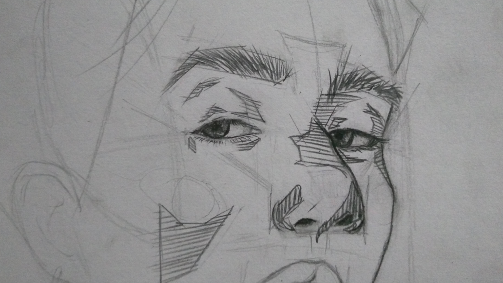

    
<header>
    
    

        <h1 class="principal-apresentation">OPA ✌, TUDO BEM?</h1>
        <section class="apresentations">
            <section class="first-apresentation">
                <h1>Vinícius Borges</h1>
                
Programador Fullstack & Designer UX/UI

                
Carinhosamente apelidado de “O Dev que Tudo Vê”, faço
                    da programação uma arte. Acredito que cada linha de
                    código deve ser vista e contemplada por todos.

            </section>
            <section class="second-apresentation">
                <h1>O dev que tudo vê</h1>
                
Eu consigo te ver, então mantenha seus olhos em
                    <em>mim</em>

            </section>
        </section>
    

</header>