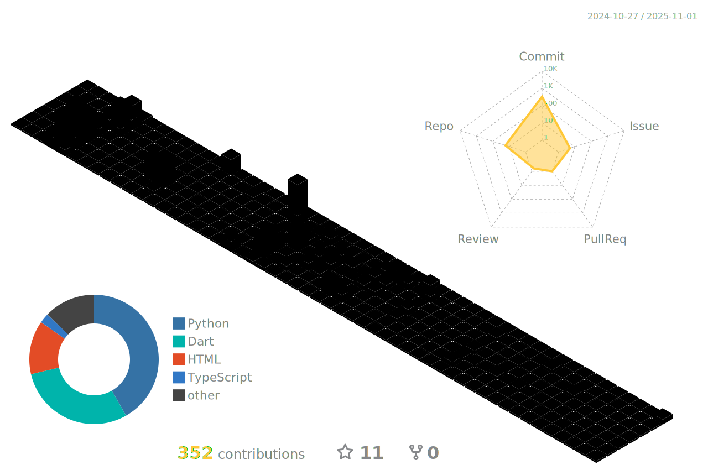

    
    <section class="about">
        <h1>Sobre mim</h1>
        
Com 22 anos, nascido e criado no Brasil, iniciei minha carreira em tecnologia com HTML, CSS e JavaScript. Ao me aprofundar em design e aprender novas tecnologias, transicionei do frontend para o fullstack, onde gosto de trabalhar tanto no frontend quanto no backend. Tenho grande interesse em utilizar o padrão MVC nos meus projetos, bem como realizar toda a gestão, desde a modelagem UML até a normalização do banco de dados.

    </section>
    <section class="interests">
        <h1>Como "O Dev que Tudo Vê", minha atenção estará voltada para ti se você falar sobre:</h1>
        <section class="flex">
            <ul class="interests-list">
                <li>Padrões de projetos</li>
                <li>MVC</li>
                <li>Modelagem de dados</li>
                <li>Diagramas UML</li>
                <li>UX/UI</li>
                <li>React</li>
                <li>Python</li>
                <li>Artes</li>
                <li>Next</li>
                <li>Nest</li>
                <li>PHP</li>
            </ul>
            
        </section>
    </section>

<h1>Staxkscks</h1>
